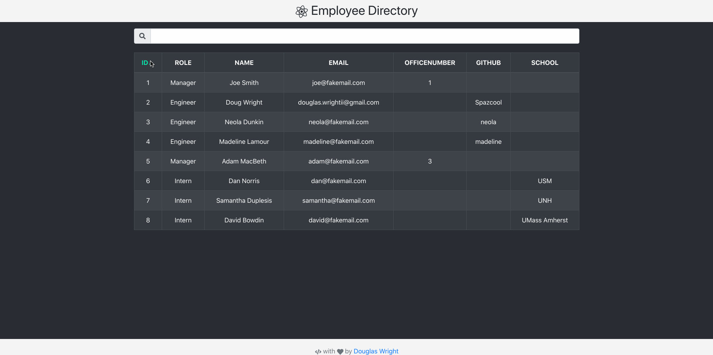
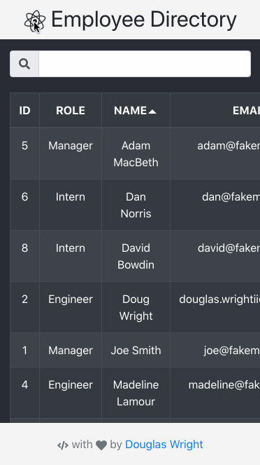

<!-- todo 
* arrows on sorted column
* text highlighting on filter
* flip icons on hover 
* center table
-->

# Employee Directory
For this assignment, you'll create a employee directory with React. This assignment will require you to break up your application's UI into components, manage component state, and respond to user events.

As a user, I want to be able to view my entire employee directory at once so that I have quick access to their information.

An employee or manager would benefit greatly from being able to view non-sensitive data about other employees. It would be particularly helpful to be able to filter employees by name.

   
   

## Getting Started

Play on my [site](http://www.spazcool.com/employee-directory/) or host locally after cloning from the [Repo](https://github.com/Spazcool/employee-directory).

### Prerequisites

A browser and an internet connection is all you'll need.

### Installing

No installation required.

## Built With

* JS & React
* HTML
* CSS & ReactBootstrap

## Authors

* **Douglas Wright** - [Spazcool](https://github.com/Spazcool)

## License

This project is licensed under the MIT License - see the [LICENSE.md](LICENSE.md) file for details
